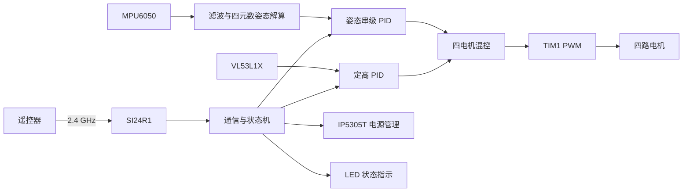
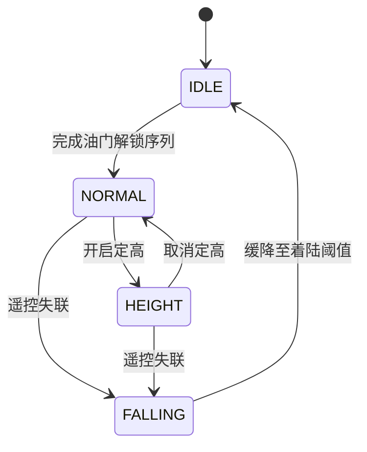

# 基于 STM32F407 的四旋翼飞行控制器

一个面向学习与实验的四旋翼飞控项目。工程以 **STM32F407** 为主控，使用 STM32 HAL、FreeRTOS 和 CMake，完成了遥控数据接收、姿态解算、串级 PID、电机混控、激光定高、电源管理及飞行状态管理等基础功能。

> [!WARNING]
> 本项目目前属于原型/学习阶段，PID 参数、传感器方向、电机顺序和失控保护都必须结合实际机架重新校准。首次测试请拆除螺旋桨并固定机体，确认电机转向和控制极性后再进行低风险试飞。请勿将本项目直接用于载人、商业或其他安全关键场景。

## 功能概览

- FreeRTOS 多任务调度，包含电源、飞控、无线通信和 LED 状态任务
- MPU6050 六轴数据采集、零偏校准、低通/卡尔曼滤波
- 基于四元数的姿态解算，输出 Pitch、Roll、Yaw 欧拉角
- Pitch、Roll、Yaw 角度外环 + 角速度内环串级 PID
- TIM1 四通道 PWM 电机输出与四旋翼混控
- SI24R1 2.4 GHz 无线遥控数据链路及连接状态检测
- VL53L1X ToF 测距与单环定高 PID
- 遥控失联后基于高度目标递减的辅助缓降逻辑
- IP5305T 电源按键模拟、周期保活与遥控关机
- USART1 调试日志和四路 LED 状态指示
- STM32CubeMX `.ioc` 配置与 GCC/CMake/Ninja 构建支持

## 系统架构



软件按职责分为四层：

| 目录 | 说明 |
| --- | --- |
| `Core/` | STM32CubeMX 生成的启动、时钟与外设初始化代码 |
| `Drivers/` | STM32F4 HAL 和 CMSIS |
| `FreeRTOS/` | FreeRTOS 内核、Cortex-M4F 移植层与 `heap_4` |
| `Interface/` | MPU6050、SI24R1、VL53L1X、电机、LED 和 IP5305T 硬件接口 |
| `Commom/` | 调试输出、延时、滤波、姿态解算、PID 和公共数据结构 |
| `APP/` | 飞控算法、遥控协议、状态机和 FreeRTOS 任务 |
| `cmake/` | ARM GCC 工具链和 CubeMX CMake 配置 |

## 硬件组成与引脚

主控工作频率配置为 168 MHz。项目当前使用的主要器件和接口如下：

| 模块 | 外设 | STM32F407 引脚 | 说明 |
| --- | --- | --- | --- |
| MPU6050 | I2C1 | PB8/SCL、PB9/SDA | ±2000 °/s、±2 g，500 Hz 采样配置 |
| VL53L1X | I2C2 | PF1/SCL、PF0/SDA | 长距离模式，20 ms 测量周期 |
| VL53L1X 复位 | GPIO | PB12/XSHUT | 低电平复位 |
| SI24R1 | SPI1 | PB3/SCK、PB4/MISO、PB5/MOSI | SPI 主机，当前约 5.25 Mbit/s |
| SI24R1 控制 | GPIO | PB7/CSN、PB6/CE | RF 通道 40，2 Mbit/s 配置 |
| 左上电机 | TIM1_CH4 | PA11 | PWM 输出 |
| 左下电机 | TIM1_CH2 | PE11 | PWM 输出 |
| 右上电机 | TIM1_CH1 | PA8 | PWM 输出 |
| 右下电机 | TIM1_CH3 | PE13 | PWM 输出 |
| 调试串口 | USART1 | PA9/TX、PA10/RX | 115200、8-N-1 |
| 电源控制 | GPIO | PB15/POWER_KEY | 开漏方式模拟 IP5305T 按键 |
| 状态 LED | GPIO | PE2、PC10、PA2、PB11 | 连接与飞行状态指示 |

TIM1 的预分频值为 2、自动重装值为 999；代码将电机比较值限制在 `0~600`。实际电调/驱动电路所需的 PWM 频率、极性和安全范围应以硬件为准。

## FreeRTOS 任务

系统节拍为 1 kHz，动态内存使用 `heap_4`，堆大小为 17 KiB。任务优先级越大越高。

| 任务 | 优先级 | 周期/等待 | 主要职责 |
| --- | ---: | ---: | --- |
| `power_task` | 4 | 最长 10 s | IP5305T 周期保活，响应关机通知 |
| `flight_control_task` | 3 | 6 ms | 传感器采样、姿态解算、PID 和电机输出 |
| `com_task` | 2 | 6 ms | 遥控数据解析、连接检测与飞行状态切换 |
| `LED_task` | 1 | 100 ms | 显示遥控连接和飞行状态 |

飞行状态机如下：



解锁序列为：油门保持高位约 1 秒，回到低位并保持约 1 秒。该流程只是一层软件保护，调试时仍应采取物理断桨、急停和限位措施。

## 遥控数据帧

SI24R1 有效载荷宽度配置为 20 字节。应用层使用前 17 字节，所有多字节字段均为大端序：

| 偏移 | 长度 | 字段 | 说明 |
| ---: | ---: | --- | --- |
| 0 | 3 | 帧头 | ASCII `YJR` |
| 3 | 2 | `throttle` | 油门 |
| 5 | 2 | `yaw` | 偏航目标，中值 500 |
| 7 | 2 | `pitch` | 俯仰目标，中值 500 |
| 9 | 2 | `roll` | 横滚目标，中值 500 |
| 11 | 1 | `altitude` | 定高控制 |
| 12 | 1 | `shutdown` | 关机控制 |
| 13 | 4 | `checksum` | 字节 0~12 的无符号累加和 |
| 17 | 3 | 保留 | 当前未解析 |

发送端必须与固件中的地址、RF 通道、数据速率、载荷宽度和校验算法保持一致。

## 构建环境

请先安装以下工具，并确保可执行文件位于 `PATH`：

- CMake 3.22 或更高版本
- Ninja
- Arm GNU Toolchain（提供 `arm-none-eabi-gcc`、`arm-none-eabi-objcopy` 等命令）
- 可选：STM32CubeMX，用于查看或修改 `Flight_Hal.ioc`
- 可选：STM32CubeProgrammer、OpenOCD 或其他支持 ST-Link 的烧录工具

### 编译 Debug 版本

```bash
git clone git@github.com:YangJR08/Flight_controller_based_on_STM32F407.git
cd Flight_controller_based_on_STM32F407

cmake --preset Debug
cmake --build --preset Debug
```

生成的 ELF 文件位于：

```text
build/Debug/Flight_Hal.elf
```

Release 构建：

```bash
cmake --preset Release
cmake --build --preset Release
```

如烧录工具需要 HEX 或 BIN，可转换 Debug 产物：

```bash
arm-none-eabi-objcopy -O ihex build/Debug/Flight_Hal.elf build/Debug/Flight_Hal.hex
arm-none-eabi-objcopy -O binary build/Debug/Flight_Hal.elf build/Debug/Flight_Hal.bin
```

## 上电与调试

1. 拆除螺旋桨，检查电源、传感器、无线模块和四路电机接线。
2. 编译并通过 ST-Link 烧录 `Flight_Hal.elf`。
3. 连接 USART1，串口参数设置为 115200、8 数据位、无校验、1 停止位。
4. 保持机体静止并水平放置后上电，让 MPU6050 完成零偏校准。
5. 检查 SI24R1 初始化日志、遥控数据、姿态方向和四路电机输出。
6. 按实际机架逐步校准传感器安装方向、PID 参数、混控极性和定高参数。

调试日志开关位于 `Commom/Com_h/Com_debug.h`。当前实现使用 `#ifdef DEBUG_LOG_ENABLE`，因此若要彻底关闭日志，需要注释/取消定义该宏（只把值改为 `0` 仍会编译日志代码）。阻塞式串口输出会占用控制周期，完成调试后建议关闭高频日志。

## LED 状态

| LED 组 | 状态 | 表现 |
| --- | --- | --- |
| PE2、PC10 | 遥控已连接 | 常亮 |
| PE2、PC10 | 遥控已断开 | 熄灭 |
| PA2、PB11 | 空闲 | 每 500 ms 翻转 |
| PA2、PB11 | 普通/定高飞行 | 每 200 ms 翻转 |
| PA2、PB11 | 失联故障 | 熄灭 |

## 当前状态与后续工作

当前仓库已经形成完整的飞控软件链路，但仍建议在实际飞行前完成以下工作：

- 使用真实接收数据验证 SI24R1 收发路径、超时判断和失联保护；当前 `APP_receive_data()` 调用了发送接口 `Int_SI24R1_TxPacket()`，联调时应确认是否需要改为 `Int_SI24R1_RxPacket()`
- 为遥控数据增加更强的长度、范围、序号和完整性校验
- 根据机架、电机、桨叶和载荷重新标定全部 PID 参数
- 增加传感器初始化失败、异常读数和任务栈溢出的处理
- 增加电池电压监测、独立急停、看门狗和电机输出失效保护
- 在台架上覆盖解锁、定高、失联缓降和着陆状态转换测试

更详细的开发过程与设计笔记见 [`Xmind.md`](Xmind.md)。

## 许可证

仓库目前未提供项目级开源许可证。在许可证补充之前，默认保留项目源码的全部权利；`Drivers/` 等第三方组件遵循其目录内各自的许可证文件。
