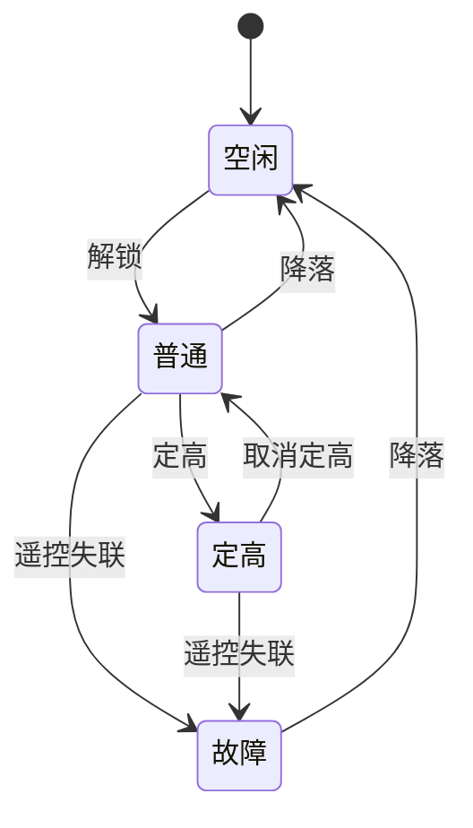

## Git指令解析
1、`git remote add origin git@github.com:YangJR08/Flight_controller_based_on_STM32F407.git`
`remote`操作「远程仓库」（就是 GitHub 上的仓库）
`add`添加 / 建立关联
`origin`给远程仓库起的默认别名（约定俗成的名字，代表「主远程仓库」，不用改）
`git@github.com:YangJR08/Flight_controller_based_on_STM32F407.git`GitHub 仓库的 SSH 地址（远程仓库的唯一地址）
2、`git branch -M main`
`git branch`Git 专门用来操作分支的命令（查看、创建、重命名分支都用它）
`-M`大写的 M，是 --move --force 的缩写，意思是：强制重命名分支
小写 -m：普通重命名（重名会报错）
大写 -M：强制重命名（不管有没有重名，直接改）
`main`新的分支名字（现在 GitHub / 码云 统一用 main 作为默认主分支）
2、`git push -u origin main`
`git push`Git 核心命令：把本地仓库的代码，推送到远程仓库（GitHub）
`-u`全称`--set-upstream`，绑定关联作用：让本地`main`分支和远程`main`分支永久绑定这是第一次推送必须加的参数
`origin`之前用`git remote add`设置的远程仓库别名（代表 GitHub 上的飞控仓库）
`main`要上传的本地分支名（就是刚重命名的主分支）
## 串口输出打印
1、使用串口1
CubeMX中配置串口1
`User label` P_TX P_RX
添加公共层`Commom`，并在里面添加`Com_debug.c`完成`int fputc(int ch, FILE *f)`重定向
CMake + GCC/newlib的 `printf` 实际走的是 `_write()`，而 `_write()` 又调用弱符号 `__io_putchar()`
所以需要重定向`__io_putchar()`
代码展示
```c
// 将 newlib 的底层输出重定向到串口（printf 通过 _write -> __io_putchar 走这里）
int __io_putchar(int ch)
{
    uint8_t c = (uint8_t)ch;

    // 兼容终端换行显示
    if (c == '\n')
    {
        uint8_t cr = '\r';
        HAL_UART_Transmit(&huart1, &cr, 1, 1000);
    }

    HAL_UART_Transmit(&huart1, &c, 1, 1000);
    return ch;
}

// 兼容直接调用 fputc 的代码
int fputc(int ch, FILE *f)
{
    (void)f;
    return __io_putchar(ch);
}
```
2、使用宏定义完成串口输出行号和文件名
`#define debug_printf(format, ...) printf("[%s:%d]" format, __FILE__, __LINE__, ##__VA_ARGS__)`
3、串口在cpu上占用资源
比如波特率`115200 Bits/s` 起始位1位，停止位1位，无校验位，数据位8位，这样算下来一字节数据就是10位。
`Hello world！`12个字节，一个字符一字节，12*10=120位，120/115200=0.0010416666666667s=1.04毫秒
所以后续调试完成之后需要关闭日志输出，所以需要加入宏定义开关
## 移植FreeRTOS
工程下面创建FreeRTOS文件夹
“FreeRTOS\”创建portable文件夹，用来适配不同芯片的
1、复制需要使用到的源代码文件
“..\FreeRTOS-LTS\FreeRTOS\FreeRTOS-Kernel”目录下所有.c文件到FreeRTOS文件夹
“..\FreeRTOS-LTS\FreeRTOS\FreeRTOS-Kernel\include”复制include整个文件到FreeRTOS文件夹
选择与芯片/工具链匹配的port目录复制到FreeRTOS\portable（如Cortex-M4F + GCC用 portable\GCC\ARM_CM4F\port.c 与 portmacro.h）
“..\FreeRTOS-LTS\FreeRTOS\FreeRTOS-Kernel\portable\MemMang”内存管理选择一个实现（如heap_4.c）复制到FreeRTOS\portable
FreeRTOSConfig.h 优先从对应Demo工程拿一份做基础，再按芯片时钟/中断优先级/是否MPU等修改；没有Demo时才用 template_configuration 作为起点
2、修改相应中断
`pednsv`、`SVC`中断进行宏替换，在FreeRTOSConfig.h中
```c
#define xPortPendSVHandler   PendSV_Handler
#define vPortSVCHandler     SVC_Handler
```
systick中调用`xPortSysTickHandler( void );`

## 电源管理任务
### 芯片介绍
1、电源管理芯片IP5305T的逻辑：物理按键，短按一次开机，1s内连续两次短按关机，自动管理锂电池充放电
2、IP5305T输出电压是5V，用一个ldo5V-3.3V
3、检测到长时间低功耗，会关机
### 代码逻辑
因为低压工作关机，24-40s内低功耗会关机
所以需要我们GPIO口输出一个低电平，记得配置开漏输出避免短路
创建任务，在任务里面10s触发一次，用`vTaskDelayUntil(&xLastWakeTime, 10000);`精确延时
GPIO按下拉低电平100ms后恢复
```c
#define POWER_KEY_Pin GPIO_PIN_15
#define POWER_KEY_GPIO_Port GPIOB
```
## 电机控制模块
用PWM波来控制电机转速，因为电机有惯性，所以可以用PWM来控制
使用定时器1，HCLK时钟168MHz，定时器1时钟也是168MHz，PSC设置为2+1，所以定时器时钟为56Mhz。
ARR重装载值是999+1；占空比初始值200。
定时器1输出4路pwm，周期一样修改占空比，PA8 TIM1_CH1右上、PA11 TIM1_CH4 左上、PE11 TIM1_CH2左下、PE13 TIM1_CH3右下
使用结构体封装TIM句柄、通道和占空比，控制转速传参只需要这一个结构体，并且用创建结构体数组和enum，来区分不同位置电机

## LED灯状态任务
将它设置为1最低优先级，如果它都能正常闪烁代表1优先级以上的任务也能正常运行
使用引脚：PE2 左上，PC10 右上，PA2 左下，PB11 右下
前两个 LED（状态指示：遥控器连接状态）
遥控器已连接：常亮
遥控器未连接：常灭
后两个 LED（状态指示：飞行器飞行状态）
飞行器空闲：慢闪烁（500ms 翻转一次）
正常飞行 / 定高飞行：快闪烁（200ms 翻转一次）
飞行器故障 / 坠落：常灭

## 无线通讯模块
安信可公司有手册驱动电路等提供，需要对使用的芯片SI24R1进行驱动移植
使用芯片的SPI1外设，涉及引脚PB3(SPI1_SCK) PB4(SPI1_MISO) PB5(SPI1_MOSI) PB7(SPI_NSS) PB6 (SI-EN)-高电平有效配置时默认低电平
`READ_REG`、`WRITE_REG`修改驱动里这两个宏定义，因为在stm32库中会重复定义，修改为`SI24R1_WRITE_REG`、`SI24R1_READ_REG`。
剩下的宏定义不用修改，需要重写剩下的函数
### 完成数据解析
保证和遥控器传输的数据一致性解析，高位在前

## 飞行器连接状态
定义了
```c
//表示当前连接状态
typedef enum{
    REMOTE_CONNECTED = 0, // 遥控器已连接
    REMOTE_DISCONNECTED,  // 遥控器已断开
} Remote_State;

//飞行状态
typedef enum{
    FLIGHT_IDLE = 0, // 飞行器空闲
    FLIGHT_NORMAL,      // 正常飞行
    FLIGHT_HEIGHT,     // 定高中飞行
    FLIGHT_FALLING,    // 故障
} Flight_State;


//封装飞机状态
typedef struct{
    Remote_State remote_state; // 当前连接状态
    Flight_State flight_state; // 当前飞行状态
} Aircraft_State;
```
最后是`Aircraft_State`这样一个全局变量，最后修改这个全局变量就可以更新飞行状态的值，因为这个只有一个地方存在修改可以不用加互斥锁。
### 关机命令
收到关机命令执行电源的关机操作
在通讯任务中解析关机指令，为了任务架构不混乱，将关机这个操作放在电源任务中执行
所以需要用到` xTaskNotifyGive(power_task_Handle);`,并且在电源任务中等待这个通知，` uint32_t ulNotification = ulTaskNotifyTake(pdTRUE, pdMS_TO_TICKS(POWER_TASK_DELAY_MS));`1代表有信号执行关机操作，0代表没有信号，就一直等待10s执行电源启动任务避免低功耗关机。
## 处理飞机不同状态
引入状态机，按键或者摇杆数量有限，但是可以根据状态机，每处于不同状态，按键和摇杆能有不同的表达
先画状态机图，罗列不同状态，然后状态和状态之间转换

